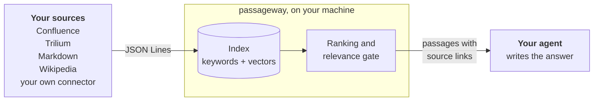

---
hide:
  - navigation
  - toc
---

# The answer is hidden somewhere across your sources. passageway finds it.

passageway searches all your sources at once, wiki, notes and documentation, and gives your agent exactly the passages that answer the question, each linked to its source.

[Install and run](install.md){ .md-button .md-button--primary }
[Write a connector](guides/write-a-connector.md){ .md-button }

- **On premise.** Your knowledge stays on your infrastructure.

    [Run it yourself](deploy.md)

- **Connected.** Confluence, Trilium, Markdown and Wikipedia work out of the box.

    [See the connectors](connectors/confluence.md)

- **Open.** A documented protocol lets you add any source or embedding model, in any language.

    [Read the protocol](reference/connector-protocol.md)

Free for private use. Companies need a licence. [Details](licence.md)

## How it fits together

```mermaid
flowchart LR
  S["<b>Your sources</b><br/>Confluence<br/>Trilium<br/>Markdown<br/>Wikipedia<br/>your own connector"]
  subgraph P["passageway, on your machine"]
    I[("Index<br/>keywords + vectors")] --> R["Ranking and<br/>relevance gate"]
  end
  S -- "JSON Lines" --> I
  R -- "passages with<br/>source links" --> G["<b>Your agent</b><br/>writes the answer"]
```

passageway is the retrieval half of a RAG system, served as an MCP tool. It does no generation: the agent that calls it reads the passages and writes the answer. [How it works](how-it-works.md)

- **The core knows no source.** A connector is any executable that prints items as JSON Lines.
- **Quiet on purpose.** A relevance gate returns nothing instead of padding a prompt with weak matches.
- **Measured.** Right article in the top three for 88.6% (95% interval 79–94%) of 70 questions on a sample corpus. [The method and its limits](measurements.md)

## Start

- [**Install in Claude Code**](install.md): the plugin sets up the server, the sources and the hook for you.
- [**Add a source**](connectors/markdown.md): [Markdown](connectors/markdown.md), [Trilium](connectors/trilium.md), [Confluence](connectors/confluence.md), [Wikipedia](connectors/wikipedia.md), [llms.txt](connectors/llmstxt.md), [Sitemap](connectors/sitemap.md).
- [**Measure your own notes**](guides/evaluate.md): `passageway eval` on your questions, and [choose a model](models.md).

[What passageway stands for](values.md) and the [roadmap](roadmap.md), for what is planned.
